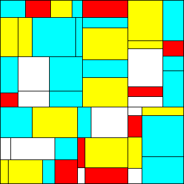
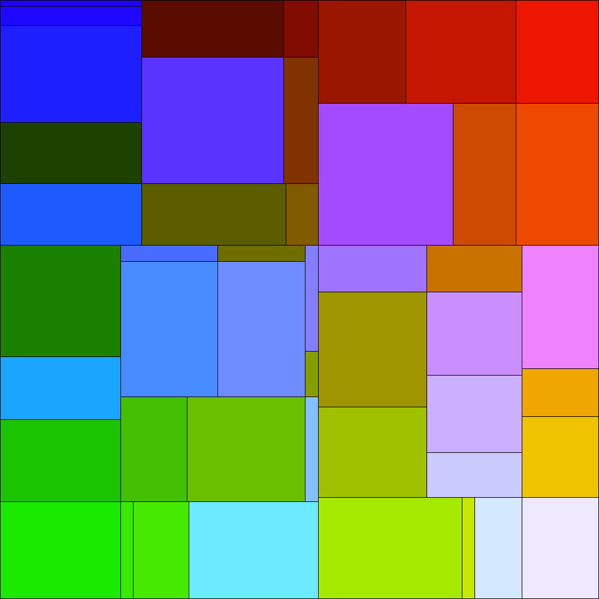

# Mondrian Art Generator

Generates a pseudo-random artwork in the style of Piet Mondrian using recursive rectangle subdivision in Java.

 

## How it works
The canvas is recursively split into smaller rectangles, vertically or horizontally, until a minimum size is reached. Colors are then filled in varying ways, random or pattern-based.

## Requirements
Java 11+

*If you're currently enrolled in a course using this assignment, please don't copy this work.*
